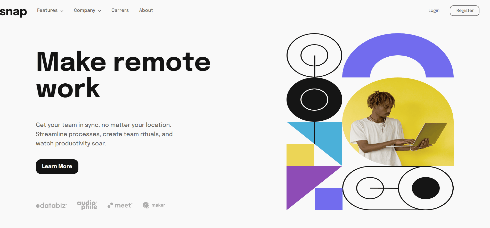

# Frontend Mentor - Intro section with dropdown navigation solution

This is a solution to the [Intro section with dropdown navigation challenge on Frontend Mentor](https://www.frontendmentor.io/challenges/intro-section-with-dropdown-navigation-ryaPetHE5). Frontend Mentor challenges help you improve your coding skills by building realistic projects.

## Table of contents

- [Overview](#overview)
  - [The challenge](#the-challenge)
  - [Screenshot](#screenshot)
  - [Links](#links)
- [My process](#my-process)
  - [Built with](#built-with)
  - [What I learned](#what-i-learned)
  - [Continued development](#continued-development)
  - [Useful resources](#useful-resources)
- [Author](#author)
- [Acknowledgments](#acknowledgments)

## Overview

### The challenge

Users should be able to:

- View the relevant dropdown menus on desktop and mobile when interacting with the navigation links
- View the optimal layout for the content depending on their device's screen size
- See hover states for all interactive elements on the page

### Screenshot

### Links

- Solution URL: [github](https://github.com/theonlylooker/dropdown-navigation)
- Live Site URL: [netlify](https://moonlit-panda-ff1f33.netlify.app/)

## My process

### Built with

- Semantic HTML5 markup
- CSS
- Flexbox
- Mobile-first workflow
- [React](https://reactjs.org/) - JS library
- [Styled Components](https://styled-components.com/) - For styles

### What i learned

In this proyect i was mayorly focused in css, the list of things i learned was.

- Modals
- Styled Components

#### Modals

I have seen modals, but i never tried working on one myself, so it was a first time, i am sure there are a lot to be improved with it.

#### Styled Components

I knew about the Styled Components and how this makes components have css embedded inside. Makes easy to model a simple UI component instead of have more css inside index.css, and you can focus on style the component, making it more reusable

### Continued development

- I want to focus more on styled components, i didn't use it here but the creating a personalized theme as i read can make things more easy,
- I did use css flex, but i was having dificulties trying to move certaing objects to be perfect, so i want to get more comfortable with css flex as well as learning more about css grid
- Another things i want to reinforce is about positioning on css

### Useful resources

- [Example resource 1](https://medium.com/building-crowdriff/styled-components-to-use-or-not-to-use-a6bb4a7ffc21) - Here i found a discussion about the use of styled components.
- [Example resource 2](https://dev.to/elijahtrillionz/complete-guide-on-how-to-use-styled-components-in-react-360c) - This is an amazing article which helped me understand styled components. I'd recommend it to anyone still learning this concept.

## Author

- Website - [Eduardo Rolando Basurco Cayllahua](https://www.your-site.com)
- Frontend Mentor - [@theonlylooker](https://www.frontendmentor.io/profile/theonlylooker)

## Acknowledgments

I got some help from my friend alrus2797 about some specifics about positioning .
